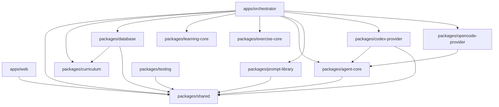
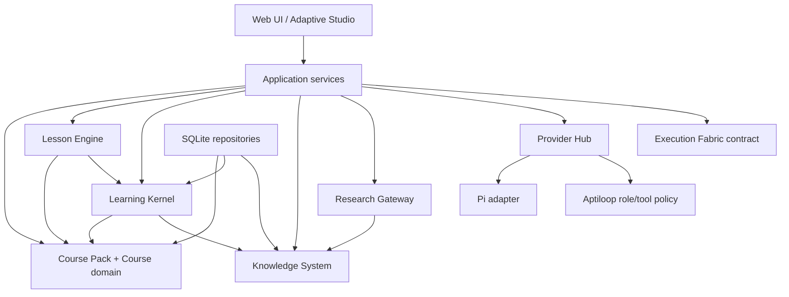

# Aptiloop Core Alpha architecture

**Document status:** Approved Core Alpha target. Implemented baseline statements are explicitly identified below.
**Scope:** domain and application architecture only. Runtime execution, deployment, and operations are specified elsewhere.
**Rule:** a sentence marked **Implemented baseline** is a claim about the repository and cites its evidence. All other normative statements are labeled **Approved Core Alpha target**, **Proposed pending owner approval**, or **Future**.

## Architectural intent

**Approved Core Alpha target.** Aptiloop is a local-first, single-user learning application. `Course` is the top-level domain entity. A Course has immutable revisions, and the learner's adaptation is a personal branch derived from a published revision. A lesson is a finite, validated activity graph. The deterministic Learning Kernel, not the browser and not a model, owns progress transitions, evidence acceptance, summaries, review scheduling, and mastery.

The Core Alpha boundary is deliberately narrow:

- SQLite is the current system of record, with identifiers, repositories, transactions, and domain constraints shaped so that PostgreSQL can replace the storage adapter later.
- Course Packs are declarative data. They contain no commands, scripts, secrets, provider credentials, executable plugins, or arbitrary filesystem/network references.
- Source Snapshots and Knowledge Capsules make provenance explicit.
- Pi is the model/runtime seam behind Aptiloop-owned typed tools. It is not the product's policy, identity, persistence, role, or permission boundary.
- Provider connections are configured independently of Aptiloop roles. A role profile references a connection and model only after capability validation.
- Real-provider failure is explicit. There is no silent substitution with Mock or another provider.
- Private learner or author data is never uploaded or shared without an explicit user action at the point of disclosure.

## Implemented baseline: package graph

**Implemented baseline.** The repository is an npm workspace with `apps/*` and `packages/*`, Node `>=24`, a shared lockfile, and Turborepo scripts (`package.json:1-39`). The current package names retain the legacy `@dlh/*` scope; that is evidence of the baseline, not target naming compliance.

**Implemented baseline.** `apps/web` imports only `@dlh/shared` among internal packages (`apps/web/package.json:15-38`). `apps/orchestrator` composes every domain and adapter package and registers separate versioned learning, authoring, and interview route modules (`apps/orchestrator/package.json:14-26`; `apps/orchestrator/src/app.ts:6-51,370-372`). `packages/database` depends on curriculum and shared contracts (`packages/database/package.json:21-24`). `learning-core`, `curriculum`, and `exercise-core` have no internal runtime dependencies in their manifests (`packages/learning-core/package.json:1-24`; `packages/curriculum/package.json:1-18`; `packages/exercise-core/package.json:1-20`). Provider adapters sit behind `AgentProvider`; Codex depends on agent-core/shared and OpenCode depends on agent-core plus its SDK (`packages/agent-core/src/provider.ts:12-19`; `packages/codex-provider/package.json:15-17`; `packages/opencode-provider/package.json:17-20`).

**Implemented baseline.** The principal request path is browser presentation → Hono orchestrator → repositories/pure rules/adapters. The orchestrator opens, migrates, and seeds SQLite, creates provider adapters, and owns provider sessions and exercise roots (`apps/orchestrator/src/app.ts:180-235`).

## Reusable seams to preserve

| Seam                                               | Classification       | Evidence and target treatment                                                                                                                                                                                                                                                                                                                                                                                                                                                                                                    |
| -------------------------------------------------- | -------------------- | -------------------------------------------------------------------------------------------------------------------------------------------------------------------------------------------------------------------------------------------------------------------------------------------------------------------------------------------------------------------------------------------------------------------------------------------------------------------------------------------------------------------------------- |
| Shared validation contracts                        | Implemented baseline | Strict Zod DTOs cover curriculum, snapshots, provider status/events, and mutations (`packages/shared/src/curriculum.ts:27-51,63-86,248-294,442-454`; `packages/shared/src/agent.ts:5-118`). Preserve as boundary contracts; split domain-specific modules only when callers migrate.                                                                                                                                                                                                                                             |
| Deterministic learning rules                       | Implemented baseline | Pure progression validates IDs, prerequisites, cycles, and transitions (`packages/learning-core/src/unit-progression.ts:47-113,177-238`). Mastery and summary reducers are deterministic functions (`packages/learning-core/src/mastery.ts:87-170`; `packages/learning-core/src/day-summary.ts:84-122`). Evolve these into the Learning Kernel.                                                                                                                                                                                  |
| Immutable authored revisions and session snapshots | Implemented baseline | Published graph rows are guarded against normal mutation and sessions capture canonical snapshot JSON and hash (`packages/database/migrations/0001_versioned_curriculum.sql:11-27,151-193`; `packages/database/src/repository.ts:541-701`). Current migration repair hooks can rewrite older snapshot JSON/hashes and progress, so this is a session-time invariant rather than migration-wide immutability. Preserve and generalize the seam without rewriting historical bytes in the target migration.                        |
| Repository/storage boundary                        | Implemented baseline | SQLite access is concentrated in database repositories and migrations, although orchestrator still contains direct SQL (`packages/database/package.json:6-24`; `apps/orchestrator/src/learning-v2.ts:187-210,977-1045`). Move direct SQL behind repositories incrementally.                                                                                                                                                                                                                                                      |
| Provider lifecycle adapter                         | Implemented baseline | `AgentProvider` defines status/models/session/stream/cancel (`packages/agent-core/src/provider.ts:12-19`). Preserve the narrow lifecycle while replacing role and tool policy with the Provider Hub/Pi boundary.                                                                                                                                                                                                                                                                                                                 |
| Exercise safety primitives                         | Implemented baseline | Attempts are copied into isolated roots; browser selects only literal command ID `test`; test freshness hashes the complete Git-visible patch, but excludes Git-ignored workspace state; Reviewer mutation of that covered patch is rejected (`apps/orchestrator/src/app.ts:684-764,779-868,870-953`). Preserve the positive controls behind Execution Fabric while replacing freshness with a canonical allowed-workspace manifest and making Reviewer evidence-only; do not expose executable plans to Course Packs or models. |
| Route modules                                      | Implemented baseline | Versioned learning, curriculum editor, and interview are separately registered (`apps/orchestrator/src/app.ts:49-51,370-372`). Preserve this modularity while extracting application services from the composition root.                                                                                                                                                                                                                                                                                                         |

**Implemented baseline — M2 persistence boundary.** `packages/shared/src/course.ts` defines the strict Course/revision/section/lesson/activity/source/capsule/adaptation/session-context/evidence/review contracts. `packages/learning-core/src/activity-graph.ts` performs deterministic finite-graph/reference/type validation. `packages/database` owns the SQLite schema, additive migration/backfill, exact admission, quarantine/provenance inventory, and repository boundary. `apps/orchestrator/src/learning-v2.ts` exposes Course-scoped list/path operations and binds new/resumed sessions to an exact Course/revision/lesson/snapshot. The browser supplies entity and operation IDs only; database, filesystem, process, provider, and migration authority remain server-owned.

The active audited database and fresh databases converge on the exact current `0000`–`0010` contract, schema SHA-256 `a6a1543e468e3dbb90494bc6e5d5598933e22dd0cf49a9830f82ee695eda5a01`, and complete M2 health. Exact predecessor stages from `0000`–`0005` through `0000`–`0009` are accepted only by the explicitly authorized, backup-bound migration path; ordinary startup does not upgrade them. A missing target session context is readable only through exact `m2-v1` quarantine provenance for its source revision, lesson, and stored snapshot. `0010_m2_quarantine_immutability` freezes every quarantined source revision whose hash authorizes that compatibility read.

## Obsolete legacy bypasses

These are audit findings to migrate, not approved architecture:

1. **Implemented baseline.** Legacy `/api/dashboard` still reads the hardcoded `weekOneCurriculum`. **Historical M0 finding, closed in M1:** legacy learning mutations now return 410 before body parsing or repository writes; versioned v2 is the only supported mutation path (`apps/orchestrator/src/app.ts`; `apps/orchestrator/test/agent-policy.integration.test.ts`). The dashboard read model still needs migration to Course-owned data.
2. **Implemented M2 foundation with retained compatibility:** Course-scoped list/path APIs and exact revision ownership now exist, and session start/resume returns explicit Course context. The default compatibility route and `learner_state.default` still choose one global current path/session, so per-Course learner selection and target Home/Courses navigation remain later work.
3. **Implemented baseline.** Versioned sessions still create a synthetic legacy day row because `learning_sessions.day_id` remains mandatory (`packages/database/src/repository.ts:607-655`). This compatibility bridge must not become the target model.
4. **Historical M0 finding, closed in M1.** `/api/agent/stream` accepts only role/session/message fields; provider/model resolution is server-owned and exact, with no fallback (`apps/orchestrator/src/agent-policy.ts`; `apps/orchestrator/test/agent-policy.integration.test.ts`).
5. **Contained legacy boundary.** Codex/OpenCode adapters retain non-review tool authority internally, but M1 blocks those providers from all learning roles and provider-readiness endpoints do not activate blocked adapters. These packages remain migration inputs, not the approved Pi boundary (`packages/codex-provider/src/codex-provider.ts`; `packages/opencode-provider/src/provider.ts`; `apps/orchestrator/src/agent-policy.ts`).
6. **Implemented baseline.** Mock remains the persisted default for role selections, but execution is allowed only in explicit development/test mode; every other runtime reports honest no-AI state. Mock is never a fallback (`apps/orchestrator/src/agent-policy.ts`).
7. **Implemented baseline.** Authored Russian content and hardcoded curriculum source objects remain in `packages/curriculum`; current source records lack complete snapshot/provenance/license semantics (`packages/curriculum/src/versioned-types.ts:20-39`). They are migration inputs, not production Course Packs or localization compliance.

## Target dependency direction

**Approved Core Alpha target.** Dependency direction is a rule about ownership, not a request to move files:

Rules:

- Domain contracts and deterministic reducers do not import HTTP, React, provider SDKs, Pi, SQLite/Drizzle, filesystem, process, or deployment code.
- Application services authorize operations and coordinate transactions. HTTP handlers parse/map only; UI requests express intent, never a state transition to force.
- Storage adapters implement repository ports. SQLite is first; PostgreSQL compatibility means stable IDs, explicit transactions, portable types, no domain dependence on SQLite row IDs or global singleton queries.
- Provider Hub owns connection/model/capability resolution. Aptiloop role policy owns which typed tools exist. Pi or any provider adapter is below both.
- Research Gateway is the only model-accessible route to external sources, and it accepts registered source identifiers rather than arbitrary URLs.
- Execution Fabric maps trusted check/environment IDs to server-owned plans. Course Packs, browsers, and models cannot supply executable, arguments, working directory, environment variables, or state transitions.

## Domain ownership and authoritative writes

| State                            | Sole authority                        | Model/browser allowance                                                                                                                                                             |
| -------------------------------- | ------------------------------------- | ----------------------------------------------------------------------------------------------------------------------------------------------------------------------------------- |
| Course draft                     | Course application service            | Browser sends validated edits; a model may submit a typed proposal to a draft only.                                                                                                 |
| Course publication               | Publication service after validation  | Explicit human action only. Unknown Activity/runtime/check capability or any required AI-only path blocks publication; unavailable optional AI does not. Model cannot call Publish. |
| Published CourseRevision         | Immutable revision repository         | Read only; editing begins by cloning a new draft/personal revision.                                                                                                                 |
| Lesson progress                  | Lesson Engine + Learning Kernel       | Browser submits learner actions; model may return content/proposals but cannot select transitions.                                                                                  |
| Evidence/mastery/review schedule | Learning Kernel                       | Inputs are accepted facts from typed activity adapters; model text is untrusted until a typed evaluator result passes validation.                                                   |
| Source Snapshot/Capsule          | Knowledge System via Research Gateway | User initiates capture/research; model may propose claims with citations, never rewrite a snapshot.                                                                                 |
| Provider credentials/connections | Provider Hub credential boundary      | Roles reference connection IDs; credentials never enter prompts, packs, or browser payloads.                                                                                        |
| Trusted check execution          | Execution Fabric                      | Callers choose only a known check ID allowed by the active activity/environment contract.                                                                                           |

## Incremental migration, not a file-move plan

**Approved Core Alpha target.** Migration follows behavior seams and preserves readable history:

1. **Fence the bypasses.** Mark legacy routes/data as compatibility-only; route new UI flows through versioned services; add no new legacy writes. Preserve rows and identifiers.
2. **Introduce target contracts beside current contracts.** Add Course Pack V1 validation, activity registry, Provider Hub selection, and source/capsule contracts without renaming packages or tables merely for appearance.
3. **Adapt current data.** Map `curricula → Course`, `curriculum_versions → CourseRevision`, weeks/days/units → finite Activities, and current evidence into provenance-preserving target records. Quarantine unmatched or unknown records; never guess an activity type or capability.
4. **Move authority, caller by caller.** Replace direct handler SQL and browser-controlled transitions with application services and the Learning Kernel. Replace direct provider construction/selection with Provider Hub. Replace general provider tools with Aptiloop typed tools.
5. **Dual-read and verify.** Compare current versioned responses, hashes, progress, evidence, and mastery with target projections. A mismatch blocks cutover; source rows remain untouched.
6. **Cut over writes, then reads.** New sessions and publications use target repositories first. Compatibility writes exist only while a named current caller needs them.
7. **Retire only after evidence.** Remove obsolete endpoints/columns in a later append-only migration after verified backups, persisted-data fixtures, parity evidence, and no remaining caller. This specification does not authorize deletion.

No stage is defined as “move these files.” Package or scope renames are optional later cleanup after dependency direction is enforced.

## Cross-specification map

- [Course Pack V1](docs/architecture/course-pack.md)
- [Lesson Engine](docs/architecture/lesson-engine.md)
- [Learning Kernel](docs/architecture/learning-kernel.md)
- [Knowledge System](docs/architecture/knowledge-system.md)
- [Research Gateway](docs/architecture/research-gateway.md)
- [Pi runtime boundary](docs/architecture/pi-runtime.md)
- [Provider Hub](docs/architecture/provider-hub.md)

## Future

Multi-user identity, cloud sync, remote/self-hosted access, PostgreSQL deployment, collaborative authoring, third-party plugins, arbitrary executable Course content, and production Course distribution are **Future**. None is implied by Core Alpha contracts.
