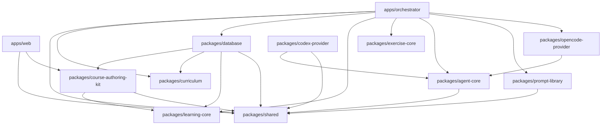
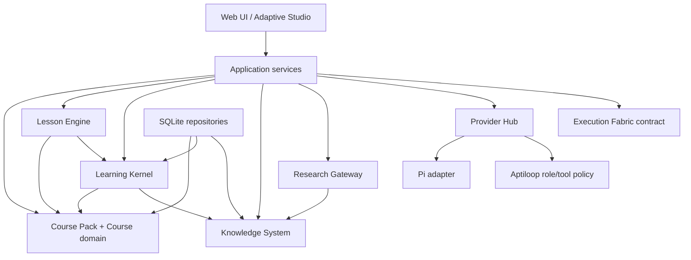

# Aptiloop Core Alpha architecture

**Document status:** Approved Core Alpha target. Implemented baseline statements are explicitly identified below.
**Scope:** domain and application architecture only. Runtime execution, deployment, and operations are specified elsewhere.
**Rule:** a sentence marked **Implemented baseline** is a claim about the repository and cites its evidence. All other normative statements are labeled **Approved Core Alpha target**, **Proposed pending owner approval**, or **Future**.

## Architectural intent

**Approved Core Alpha target.** Aptiloop is a local-first, single-user learning application. `Course` is the top-level domain entity. A Course has immutable revisions, and the learner's adaptation is a personal branch derived from a published revision. A lesson is a finite, validated activity graph. The deterministic Learning Kernel, not the browser and not a model, owns progress transitions, evidence acceptance, summaries, review scheduling, and mastery.

The Core Alpha boundary is deliberately narrow:

- SQLite is the current system of record, with identifiers, repositories, transactions, and domain constraints shaped so that PostgreSQL can replace the storage adapter later.
- Course Packs are declarative data. They contain no commands, scripts, secrets, provider credentials, executable plugins, or arbitrary filesystem/network references.
- Source Snapshots and Knowledge Capsules make provenance explicit.
- Pi is the model/runtime seam behind Aptiloop-owned typed tools. It is not the product's policy, identity, persistence, role, or permission boundary.
- Provider connections are configured independently of Aptiloop roles. A role profile references a connection and model only after capability validation.
- Real-provider failure is explicit. There is no silent substitution with Mock or another provider.
- Private learner or author data is never uploaded or shared without an explicit user action at the point of disclosure.

## Implemented baseline: package graph

**Implemented baseline.** The repository is an npm workspace with `apps/*` and `packages/*`, Node `>=24`, a shared lockfile, and Turborepo scripts (`package.json`). The root package is `aptiloop`; every internal workspace is scoped under `@aptiloop/*`.

**Implemented baseline.** `apps/web` imports browser-safe contracts from `@aptiloop/shared` and the typed `@aptiloop/course-authoring-kit/authoring-assets` subpath (`apps/web/package.json`). That Authoring Kit subpath exposes package-owned generated JSON artifacts without granting the browser filesystem, validation-service, or publication authority. `apps/orchestrator` composes the active domain packages, Provider Hub, prompt library, and the retained OpenCode endpoint validator through its config-only export; it also registers separate versioned learning, authoring, and interview route modules. `packages/database` depends on Course authoring, curriculum, learning, and shared contracts. The retained legacy provider packages are migration inputs rather than active orchestrator dependencies. `learning-core`, `curriculum`, and `exercise-core` have no browser authority; package dependencies preserve the server-owned database, provider, filesystem, Git, and process boundaries.

**Implemented baseline.** The principal request path is browser presentation → Hono orchestrator → repositories/pure rules/adapters. The orchestrator composition root (`apps/orchestrator/src/app.ts`) opens and migrates SQLite, creates provider adapters, and owns provider sessions and exercise roots. Curriculum seeding is limited to explicit development or disposable-database composition; production does not seed development Course content.

## Reusable seams to preserve

| Seam                                               | Classification       | Evidence and target treatment                                                                                                                                                                                                                                                                                                                                                                                                                                                                                                |
| -------------------------------------------------- | -------------------- | ---------------------------------------------------------------------------------------------------------------------------------------------------------------------------------------------------------------------------------------------------------------------------------------------------------------------------------------------------------------------------------------------------------------------------------------------------------------------------------------------------------------------------- |
| Shared validation contracts                        | Implemented baseline | Strict Zod DTOs in `packages/shared/src` cover Course/curriculum snapshots, provider events/status, and mutations. Preserve them as boundary contracts; split domain-specific modules only when callers migrate.                                                                                                                                                                                                                                                                                                             |
| Deterministic learning rules                       | Implemented baseline | Pure progression, mastery, summary, and the canonical fact reducer live in `packages/learning-core/src`. The Learning Kernel validates identities, prerequisites, cycles, transitions, evidence authority, replay order, and canonical projections without browser/provider/runtime dependencies.                                                                                                                                                                                                                            |
| Immutable authored revisions and session snapshots | Implemented baseline | Published graph rows are guarded against mutation and sessions capture canonical snapshot JSON and hash. Additive migrations preserve historical snapshot bytes, and ordinary startup rejects predecessor schemas instead of repairing them implicitly. Editing begins from a new Draft or personal revision; it never rewrites a published revision or prior session.                                                                                                                                                       |
| Repository/storage boundary                        | Implemented baseline | SQLite access is concentrated in `packages/database` repositories and migrations, although some orchestrator handlers still contain direct SQL. Move that residual SQL behind repositories incrementally.                                                                                                                                                                                                                                                                                                                    |
| Provider lifecycle adapter                         | Implemented baseline | `AgentProvider` retains the narrow status/models/session/stream/cancel seam. Provider Hub now owns exact connection/model/capability/disclosure resolution, and the Aptiloop typed-tool host owns finite per-role authority. Legacy Codex/OpenCode adapters remain blocked migration boundaries rather than alternate learning routes.                                                                                                                                                                                       |
| Exercise safety primitives                         | Implemented baseline | Attempts are copied into isolated roots and the browser selects only the literal operation `test`. Execution Fabric snapshots the complete allowed workspace, binds a normalized result to its SHA-256, and rejects stale input. Reviewer receives a bounded non-truncated Git diff plus current check evidence, cannot edit/apply, and must leave the complete workspace snapshot unchanged. Git-ignored allowed files are covered by the workspace snapshot even though they are not part of the human-readable Git patch. |
| Route modules                                      | Implemented baseline | Versioned learning, curriculum editor, and interview route modules are registered separately by the orchestrator composition root. Preserve this modularity while extracting application services from that root.                                                                                                                                                                                                                                                                                                            |

**Implemented baseline — M2 persistence boundary.** `packages/shared/src/course.ts` defines the strict Course/revision/section/lesson/activity/source/capsule/adaptation/session-context/evidence/review contracts. `packages/learning-core/src/activity-graph.ts` performs deterministic finite-graph/reference/type validation. `packages/database` owns the SQLite schema, additive migration/backfill, exact admission, quarantine/provenance inventory, and repository boundary. `apps/orchestrator/src/learning-v2.ts` exposes Course-scoped list/path operations and binds new/resumed sessions to an exact Course/revision/lesson/snapshot. The browser supplies entity and operation IDs only; database, filesystem, process, provider, and migration authority remain server-owned.

**Implemented baseline — current schema boundary.** Fresh and explicitly migrated databases converge on the exact `0000`–`0020` contract described in [the data model](docs/data-model.md). `0018_learner_course_state_trigger_guard` ensures that only an active session on a published target Course revision can advance learner state; completed and compatibility-only contexts remain readable without changing the selected/current target. `0019_provider_connection_retirement` adds a provider tombstone so active configuration can be removed without deleting historical evidence. `0020_adaptation_branch_lifecycle` preserves archived branch identities and their learning history, enforces one learner-active personal branch per Course, validates exact immutable upstream base and personal head ownership, and pins each immutable session context plus its Kernel writes to a revision-compatible branch. Open-as-draft uses a distinct archived authoring branch and cannot change learner scope. Revision activation is rejected while the Course has an active session; after completion, Course and learner cursors rotate transactionally while historical replay continues through the archived pinned branch. Exact predecessor stages are accepted only by the explicitly authorized, backup-bound additive migration path; ordinary startup does not upgrade them. A missing target session context is readable only through exact `m2-v1` quarantine provenance for its source revision, lesson, and stored snapshot. Dated active-database inventories and hashes belong to migration/audit evidence rather than this architecture contract.

**Implemented baseline — M10 Course Designer boundary.** `packages/shared/src/curriculum.ts` owns the strict finite workflow/request/diagnostic/proposal/diff contracts. `apps/orchestrator/src/course-designer.ts` persists idempotent state transitions and audit events, resolves the exact `course-designer` RoleProfile through Provider Hub, exposes only bounded Draft/approved-source/proposal tools, validates stable target IDs and deterministic diagnostics, and applies accepted changes transactionally only to the selected Draft. `course_draft_proposal_attribution` is immutable and records provider, connection, model, prompt template/version, disclosure identity, before/after diffs, approved-source provenance, and validation. A pending external disclosure is recoverable only for its exact Course version, workflow, and authoring operation; reload recovery reprojects server-owned workflow data and never depends on a browser-stored provider payload. Confirmation, rejection, revision, Apply, and Publish are separate operations; only `curriculum-editor.ts` can mark a validating workflow `PUBLISHED` after the existing manual publication gate. Migration `0016_course_designer_workflow` remains the additive M10 boundary beneath the current M11 schema.

**Implemented baseline — M11 Course/session cutover.** `learner_course_states` owns selected Course, active published revision, and current session per Course. `CourseFoundationRepository` resolves exact Course ownership; learning, interview, exercise, review, and agent side effects reject unverified or non-current Course sessions. The target allows simultaneous active sessions for different Courses and resumes each independently. Legacy v1 mutations and the hardcoded `/api/dashboard` surface return 410; exact historical session reads, immutable snapshots, compatibility tables, and quarantine remain locally retained. Destructive retirement is a separate owner-approved migration gate.

## Obsolete legacy bypasses

These are audit findings to migrate, not approved architecture:

1. **Historical M0 finding, closed in M11.** The hardcoded legacy `/api/dashboard` no longer reads `weekOneCurriculum`; it returns 410 and directs callers to target Home/Courses surfaces.
2. **Implemented baseline.** Course-scoped list/path APIs, explicit selected Course state, per-Course active revision/session pointers, and exact session Course context now own target reads and mutations. The unscoped `/api/learning/path` and current-session reads resolve the explicitly selected Course rather than `learner_state.default` or `LIMIT 1`.
3. **Implemented baseline.** Versioned sessions still create a synthetic legacy day row because `learning_sessions.day_id` remains mandatory in the compatibility repository. This bridge must not become the target model.
4. **Historical M0 finding, closed in M1.** `/api/agent/stream` accepts only role/session/message fields; provider/model resolution is server-owned and exact, with no fallback (`apps/orchestrator/src/agent-policy.ts`; `apps/orchestrator/test/agent-policy.integration.test.ts`).
5. **Contained legacy boundary.** Codex/OpenCode adapters retain non-review tool authority internally, but M1 blocks those providers from all learning roles and provider-readiness endpoints do not activate blocked adapters. These packages remain migration inputs, not the approved Pi boundary (`packages/codex-provider/src/codex-provider.ts`; `packages/opencode-provider/src/provider.ts`; `apps/orchestrator/src/agent-policy.ts`).
6. **Implemented baseline.** AI roles persist as no-AI by default. Mock is registered and assigned only by explicit development/test composition and is never a production default or fallback (`apps/orchestrator/src/development-server.ts`; `apps/orchestrator/src/provider-runtime.ts`).
7. **Implemented baseline.** Authored Russian content and hardcoded curriculum source objects remain in `packages/curriculum`; those legacy source records lack complete snapshot/provenance/license semantics. They are migration inputs, not production Course Packs or localization compliance.

## Target dependency direction

**Approved Core Alpha target.** Dependency direction is a rule about ownership, not a request to move files:

Rules:

- Domain contracts and deterministic reducers do not import HTTP, React, provider SDKs, Pi, SQLite/Drizzle, filesystem, process, or deployment code.
- Application services authorize operations and coordinate transactions. HTTP handlers parse/map only; UI requests express intent, never a state transition to force.
- Storage adapters implement repository ports. SQLite is first; PostgreSQL compatibility means stable IDs, explicit transactions, portable types, no domain dependence on SQLite row IDs or global singleton queries.
- Provider Hub owns connection/model/capability resolution. Aptiloop role policy owns which typed tools exist. Pi or any provider adapter is below both.
- Research Gateway is the only model-accessible route to external sources, and it accepts registered source identifiers rather than arbitrary URLs.
- Execution Fabric maps trusted check/environment IDs to server-owned plans. Course Packs, browsers, and models cannot supply executable, arguments, working directory, environment variables, or state transitions.

## Domain ownership and authoritative writes

| State                            | Sole authority                        | Model/browser allowance                                                                                                                                                             |
| -------------------------------- | ------------------------------------- | ----------------------------------------------------------------------------------------------------------------------------------------------------------------------------------- |
| Course draft                     | Course application service            | Browser sends validated edits; a model may submit a typed proposal to a draft only.                                                                                                 |
| Course publication               | Publication service after validation  | Explicit human action only. Unknown Activity/runtime/check capability or any required AI-only path blocks publication; unavailable optional AI does not. Model cannot call Publish. |
| Published CourseRevision         | Immutable revision repository         | Read only; editing begins by cloning a new draft/personal revision.                                                                                                                 |
| Lesson progress                  | Lesson Engine + Learning Kernel       | Browser submits learner actions; model may return content/proposals but cannot select transitions.                                                                                  |
| Evidence/mastery/review schedule | Learning Kernel                       | Inputs are accepted facts from typed activity adapters; model text is untrusted until a typed evaluator result passes validation.                                                   |
| Source Snapshot/Capsule          | Knowledge System via Research Gateway | User initiates capture/research; model may propose claims with citations, never rewrite a snapshot.                                                                                 |
| Provider credentials/connections | Provider Hub credential boundary      | Roles reference connection IDs; credentials never enter prompts, packs, or browser payloads.                                                                                        |
| Trusted check execution          | Execution Fabric                      | Callers choose only a known check ID allowed by the active activity/environment contract.                                                                                           |

## Implemented incremental migration boundary

**Implemented baseline.** Additive migrations introduced Course/immutable revision records, finite Activities, Source Snapshots/Capsules, Course Pack V1, Learning Kernel facts/projections, Execution Fabric identity, Provider Hub/disclosures, Course Designer workflow state, personal adaptation, and per-Course learner state beside preserved compatibility history. Target reads/writes use those repositories; legacy fixed-completion mutations are retired; unmatched meaning remains quarantined rather than guessed; browser/provider authority has moved behind app-owned services, the Learning Kernel, Provider Hub, and typed tools.

**Implemented baseline.** Skills, Mistakes, Review scheduling, progression, and mastery read only exact selected Course/revision/branch/session Learning Kernel projections. Persisted projection caches are canonical-byte checked and replayed against their append-only fact frontier before use. Summary presentation evidence carries Kernel model/version/hash/frontier provenance; pre-envelope Summary rows are accepted only when their historical clock reconstructs the same exact frontier. Trusted checks alone supply implementation correctness; an accepted Reviewer receipt records participation and its advisory result cannot alter Summary mastery, mistakes, strengths, or gaps. The preserved `topics`, `mastery_*`, `mistakes`, and `flashcards` tables are compatibility history, not parallel domain authority; no active product route writes them, and new Summary operations no longer dual-write them. Retired legacy GET routes redirect to Kernel-backed resources, while obsolete flashcard mutations fail with `410`.

**Approved Core Alpha target.** Move residual handler SQL behind repositories and remove compatibility endpoints/columns only after verified backups, persisted-data fixtures, parity evidence, and complete caller/row accounting. This does not authorize destructive history removal or a second architecture. Package/file renames remain optional cleanup rather than a migration stage.

## Cross-specification map

- [Course Pack V1](docs/architecture/course-pack.md)
- [Lesson Engine](docs/architecture/lesson-engine.md)
- [Learning Kernel](docs/architecture/learning-kernel.md)
- [Knowledge System](docs/architecture/knowledge-system.md)
- [Research Gateway](docs/architecture/research-gateway.md)
- [Pi runtime boundary](docs/architecture/pi-runtime.md)
- [Provider Hub](docs/architecture/provider-hub.md)
- [Execution Fabric](docs/architecture/execution-fabric.md)
- [Environment Packs](docs/architecture/environment-packs.md)
- [Workspaces and editors](docs/architecture/workspaces-and-editors.md)
- [Deployment models](docs/architecture/deployment-models.md)

## Future

Multi-user identity, cloud sync, remote/self-hosted access, PostgreSQL deployment, collaborative authoring, third-party plugins, arbitrary executable Course content, and production Course distribution are **Future**. None is implied by Core Alpha contracts.
