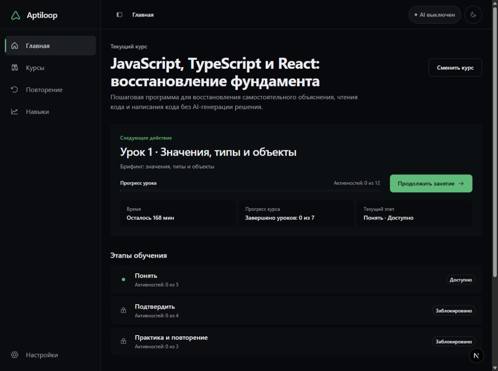
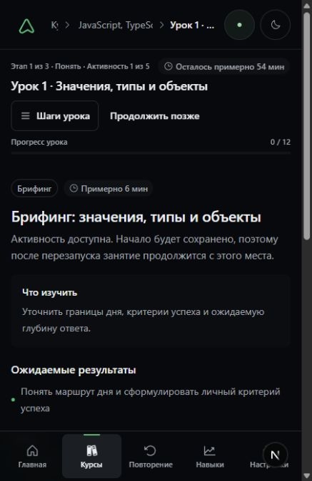

# Aptiloop

Local-first deliberate practice for durable technical skill.

Aptiloop turns an authored Course into a finite path of study, recall, explanation, implementation, trusted checks, correction, and review. The deterministic Learning Kernel owns progress and mastery; optional AI works inside explicit, constrained roles.

**Implemented baseline**

The current repository contains the runnable Aptiloop application, its local SQLite store, Course and immutable revision workflows, deterministic learning and evidence rules, Adaptive Studio, constrained Provider Hub roles, and complete `en-US`/`ru-RU` interface catalogs.

<p align="center">
  
</p>

<p align="center">
  
</p>

<p align="center"><sub>A current disposable local profile in Russian; no provider credential, account data, or private path is shown.</sub></p>

**Implemented baseline**

Aptiloop intentionally ships without bundled Courses: each learner creates a personal Course or explicitly imports a trusted Course Pack. This public source repository is the supported clone-and-run distribution and is licensed under Apache-2.0; it is not a tagged Core Alpha release.

## Start locally

**Implemented baseline**

You need Node.js 24 or newer, npm 11 (`npm@11.12.1` is pinned), and Git.

```sh
git clone https://github.com/nayvok/Aptiloop.git
cd Aptiloop
npm ci
npm start
```

Open <http://127.0.0.1:3000>. `npm start` builds and launches the local production-mode web and orchestrator processes on loopback. Stop both with `Ctrl+C`.

No `.env` file is required. The production launcher does not load one, start an external provider sidecar, expose Mock, or seed development Course content. A fresh profile creates the fixed local database, applies current migrations, and opens an empty Course library with **Create Course** and **Import Course Pack** actions. No starter, sample, or first-party Course is bundled.

An existing database must pass the exact admission gate. Startup never silently selects, repairs, or upgrades another database. Before changing valuable data, follow [Current database operations](docs/migration/current-database-operations.md).

For development with file watching and explicit development fixtures:

```sh
npm run dev
```

Development mode is separate from normal local use and may expose the deterministic development-only Mock provider. `.env.example` documents optional development overrides; copying it is not a startup step.

For optional loopback-only container packaging:

```sh
docker compose up --build
```

Open <http://127.0.0.1:3000>. No `.env` file is required. The final images run as non-root users with read-only root filesystems, production dependencies only, and no repository exercise fixtures; named volumes retain the local database and private runtime data. A fresh profile still opens an empty Course library. Compose is not an authenticated public or LAN deployment profile.

## What Aptiloop does

**Implemented baseline**

- Creates a Course manually, with optional typed AI proposals, or imports a strictly validated declarative Course Pack.
- Publishes immutable Course Revisions and keeps learner changes in a personal Adaptation Branch.
- Guides learning through a finite Activity Graph with briefing, study, recall, Tutor dialogue, quiz, code-reading, trusted exercise, interview, and summary activities.
- Records complete evidence and lets deterministic rules—not model prose—own progression, mastery, mistakes, review scheduling, and next-action selection.
- Runs allowlisted Node and Python checks in isolated learner attempts with Git- and SHA-256-bound evidence.
- Keeps Home, Courses, Review, Skills, and Settings usable across responsive light and dark layouts in `en-US` and `ru-RU`.

The core learning flow is:

```text
Course -> immutable revision -> finite activities -> recorded evidence
       -> deterministic Learning Kernel -> next action and scheduled review
```

Manual authoring remains complete without AI. Applying an AI proposal changes only a Draft; Validate, learner Preview, Change review, and explicit Publish remain separate actions.

## Optional AI

**Implemented baseline**

AI Off is a supported state. To use a provider, open **Settings → Connections**, create a connection, provide its credential through the explicit local form, and assign one exact available model to each desired role.

- Credentials stay in the app-owned local credential store and are never returned to the browser or stored in Course Packs, prompts, or SQLite. Windows protects the store with current-user DPAPI; POSIX systems keep a plaintext file with an owner-only mode request.
- Provider and model resolution is server-owned. Authentication, model, capability, network, and policy failures remain explicit; Aptiloop never silently selects another provider, model, or Mock.
- External turns require an exact operation-scoped disclosure approval that is consumed once.
- AI roles receive only Aptiloop-owned typed tools. They do not receive arbitrary filesystem, shell, network, credential, or general editing authority.

See [AI providers](docs/providers.md) for supported connection types, readiness states, privacy behavior, and recovery steps.

## Local data and safety

**Implemented baseline**

Aptiloop is local-first and single-user. Course material, learner state, evidence, mistakes, mastery, transcripts, and settings remain on the device unless the user explicitly exports or shares a named payload.

The process-mode database currently retains the compatibility path `.data/dev-learning-harness.sqlite`. Provider credentials are stored separately and must never be placed in a Course Pack, tracked source file, browser payload, or export.

On Windows, provider credentials are encrypted for the current OS user. The sanitized profile export excludes them, and copied DPAPI ciphertext cannot be decrypted by another user or computer; reconnect providers after restoring learning data. This protects an offline copy from another account, not from software already running as the same Windows user. On POSIX systems and inside the Linux Compose profile, the credential file remains private plaintext with an owner-only mode request.

Move one local profile to another computer with `npm run data:export`, then stop Aptiloop and perform the offline create-only restore with `npm run data:restore -- --source <bundle.aptiloop-data>`. Export sanitizes an intermediate snapshot and rebuilds a compact standalone SQLite payload, excluding credentials, raw provider payloads, environment files, exercise workspace files, device paths, and transient provider state. Restore never overwrites or merges an active profile. Bundle hashes provide integrity, not creator authenticity, and the bundle remains private plaintext. See [Local data portability](docs/data-portability.md).

Important boundaries:

- Run Aptiloop only on loopback. It has no authentication or authorization; do not expose it to a LAN, tunnel, public proxy, or the Internet.
- Course Packs are untrusted declarative data. They cannot contain commands, scripts, executable plugins, credentials, or absolute local paths.
- Reviewer is evidence-only and read-only. It cannot edit a workspace or apply a patch.
- Trusted local checks use bounded app-owned process plans, but they are not a hostile-code sandbox.
- Docker Compose is optional loopback-only packaging, not an authenticated self-hosting profile. Its final images omit development dependencies and repository exercise fixtures. See [Self-hosting boundaries](SELF_HOSTING.md).

## Current limits

**Implemented baseline**

- Due Review Items with a verified immutable source snapshot execute as typed free-response activities on the Review surface. Aptiloop persists the learner attempt without inventing correctness or mastery, completes the exact due cycle, and schedules a distinct successor from deterministic server rules. Stale, ambiguous, or unresolved legacy sources fail closed.
- Trusted Node and Python execution is local and unsandboxed.
- Course Pack validation staging is process-local and can require reselecting a file after a restart.
- Accessibility and responsive behavior have automated and focused browser evidence, but no complete WCAG 2.2 AA certification is claimed.
- Historical ambiguous migration rows remain quarantined rather than promoted to Course truth.

**Approved Core Alpha target**

A tagged Core Alpha release still requires third-party notice and trademark review, artifact authorization, and owner sign-off. The applied Apache-2.0 project license is independent from those release gates. A first-party or sample Course would require separate content, provenance, safety, licensing, and ownership approval, but no such Course is part of the product distribution. A fresh authenticated OpenCode Zen Tutor request is recorded as working-tree evidence; it does not certify every provider, role, or recovery path.

See the [current roadmap](ROADMAP.md), [2026-08-12 UI/UX and runtime hardening audit](docs/audits/2026-08-12-ui-ux-runtime-hardening.md), and [production-readiness polish evidence](docs/audits/2026-08-13-production-readiness-polish.md) for the precise evidence boundary.

## Develop and verify

**Implemented baseline**

This is an npm-workspaces repository with one `package-lock.json`. Do not use pnpm, Yarn, or `workspace:*` ranges.

| Command                | Purpose                                                                 |
| ---------------------- | ----------------------------------------------------------------------- |
| `npm run dev`          | Start the explicit development stack                                    |
| `npm run build`        | Build every workspace                                                   |
| `npm run format:check` | Check formatting                                                        |
| `npm run lint`         | Run all lint tasks                                                      |
| `npm run typecheck`    | Run all TypeScript checks                                               |
| `npm run test:fast`    | Run unit, integration, component, and policy tests                      |
| `npm run test:e2e`     | Run the lock-serialized Playwright suite                                |
| `npm test`             | Run fast tests followed by E2E                                          |
| `npm run verify`       | Run format, lint, typecheck, fast tests, and build; it does not run E2E |
| `npm run audit:policy` | Produce dependency policy reports                                       |
| `npm run sbom`         | Generate the CycloneDX npm SBOM                                         |
| `npm run data:export`  | Create a new sanitized local-profile transfer bundle                    |
| `npm run data:restore` | Restore one bundle offline into a fresh profile; never overwrite        |

Repository map:

| Path                     | Responsibility                                                    |
| ------------------------ | ----------------------------------------------------------------- |
| `apps/web`               | Next.js presentation and browser state                            |
| `apps/orchestrator`      | Hono HTTP/SSE composition and app-owned runtime policy            |
| `packages/shared`        | Strict schemas and boundary DTOs                                  |
| `packages/learning-core` | Deterministic learning rules                                      |
| `packages/agent-core`    | Provider Hub, role policy, typed tools, and normalized events     |
| `packages/exercise-core` | Attempts, paths, Git evidence, and bounded trusted execution      |
| `packages/database`      | SQLite schema, migrations, repositories, seed, and backup         |
| `docs`                   | Current specifications, decisions, operations, and dated evidence |

Read [Development](docs/development.md) before changing behavior and [Repository rules](AGENTS.md) before contributing.

## Documentation

**Implemented baseline**

- [Documentation index](docs/README.md)
- [Product contract](PRODUCT.md)
- [Architecture](ARCHITECTURE.md)
- [Design system](DESIGN.md)
- [Security policy](SECURITY.md)
- [Provider connections](docs/providers.md)
- [Troubleshooting](docs/troubleshooting.md)
- [Current database operations](docs/migration/current-database-operations.md)
- [Local data portability](docs/data-portability.md)
- [Roadmap](ROADMAP.md)
- [Contributing](CONTRIBUTING.md)
- [Third-party notices](THIRD_PARTY_NOTICES.md)
- [Name and branding](TRADEMARKS.md)

## License

**Implemented baseline**

Copyright 2026 Yan Yushkov (`nayvok`). First-party materials in this repository that the copyright holder has authority to license are available under the [Apache License 2.0](LICENSE), unless a file or directory states otherwise.

The covered first-party materials include source code, tests, documentation, translations, development fixtures, and project-created visual assets. The project license does not grant rights to user-authored or imported Courses, private or learner data, credentials, local databases, backups, exports, or third-party components. Those materials retain their owners and applicable terms. Aptiloop currently contains no proprietary module; any future proprietary module must be new, optional, and clearly separate from the Apache-2.0 project. Apache-2.0 does not grant rights to use Aptiloop branding to present a fork as official. See [NOTICE](NOTICE), [Third-party notices](THIRD_PARTY_NOTICES.md), [Contribution terms](CONTRIBUTING.md), and [Name and branding](TRADEMARKS.md).
