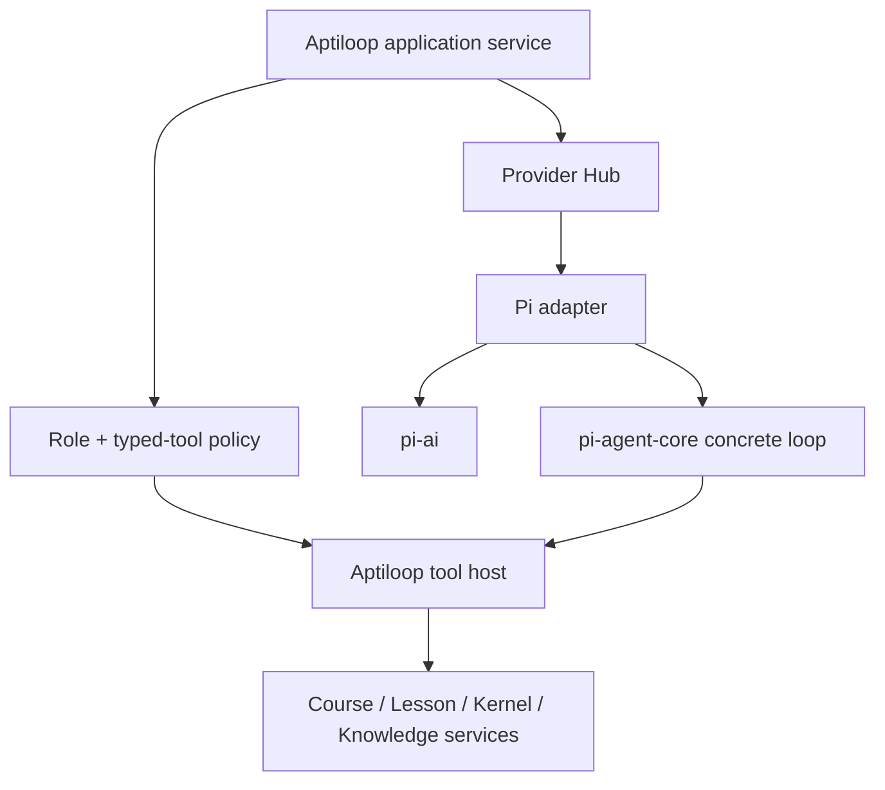

# Pi runtime boundary

**Document status:** **Implemented baseline** for the constrained current Pi adapter; durable harness/session integration and general agent behavior are **Future**.
**Evidence pins:** published v0.84.1 tag commit [`53fa77ccd8a279eb87e92294ef3687b03ff80112`](https://github.com/earendil-works/pi/tree/53fa77ccd8a279eb87e92294ef3687b03ff80112), plus separately inspected post-release upstream source commit [`9dd90a49711d088b86fdd9b4aea575913a8328`](https://github.com/earendil-works/pi/tree/9dd90a49711d088b86fdd9b4aea575913a8328), researched 2026-08-08.

## Implemented baseline

**Implemented baseline.** `@earendil-works/pi-ai` and `@earendil-works/pi-agent-core` are direct exact-version `0.84.1` production dependencies of `@aptiloop/agent-core`; `@earendil-works/pi-coding-agent` and Pi's SQLite session backend are not dependencies. `PiAgentProvider` constructs only the reviewed settings catalog and runs behind Aptiloop-owned connection, role, disclosure, tool, persistence, and no-fallback policies.

**Implemented baseline.** When an AI role is enabled and its exact selected connection/model resolves, Course Designer, learning chat, interview, and evidence-only review use Provider Hub and constrained Pi/provider adapters with one-time disclosure, cumulative turn budgets, private-context/environment sentinels, and finite role policy matrices. AI Off or an unavailable selection starts no turn. An authenticated OpenCode Zen `deepseek-v4-flash-free` smoke completed with synthetic text in a disposable database, disclosure consumption, turn-level provenance, and observed cancellation; it proves only that reviewed path. `packages/codex-provider` and `packages/opencode-provider` remain blocked legacy package adapters and cannot bypass Provider Hub. Aptiloop does not use AgentHarness v2, Pi session persistence, or coding-agent general tools.

## Exact upstream packages

**Pinned upstream evidence.** The published tag and the inspected post-release source both contain package manifests with version `0.84.1`; commit `9dd90a4` is not the v0.84.1 release provenance and includes unreleased source changes:

| Package                                          | Upstream role                                                               | Authoritative source                                                                                                                                                                                                                                                                                          |
| ------------------------------------------------ | --------------------------------------------------------------------------- | ------------------------------------------------------------------------------------------------------------------------------------------------------------------------------------------------------------------------------------------------------------------------------------------------------------- |
| `@earendil-works/pi-ai`                          | unified model/provider/auth/stream/tool message API                         | [`packages/ai/package.json`](https://github.com/earendil-works/pi/blob/9dd90a49711d088b86fdd9b4aea575913a8328/packages/ai/package.json#L1-L14)                                                                                                                                                                |
| `@earendil-works/pi-agent-core`                  | agent loop/state/tool execution                                             | [`packages/agent/package.json`](https://github.com/earendil-works/pi/blob/9dd90a49711d088b86fdd9b4aea575913a8328/packages/agent/package.json#L1-L14)                                                                                                                                                          |
| `@earendil-works/pi-coding-agent`                | coding-agent CLI/SDK with general coding tools and JSONL session management | [`packages/coding-agent/package.json`](https://github.com/earendil-works/pi/blob/9dd90a49711d088b86fdd9b4aea575913a8328/packages/coding-agent/package.json#L1-L14)                                                                                                                                            |
| `@earendil-works/pi-session-backend-sqlite-node` | separate Node `node:sqlite` SessionRepo backend for agent-core sessions     | [`package.json`](https://github.com/earendil-works/pi/blob/9dd90a49711d088b86fdd9b4aea575913a8328/packages/session-backends/sqlite-node/package.json), [`README.md`](https://github.com/earendil-works/pi/blob/9dd90a49711d088b86fdd9b4aea575913a8328/packages/session-backends/sqlite-node/README.md#L1-L12) |

**Pinned upstream evidence.** The upstream repository is MIT licensed ([`LICENSE`](https://github.com/earendil-works/pi/blob/9dd90a49711d088b86fdd9b4aea575913a8328/LICENSE#L1-L20)) and the package manifests require Node `>=22.19` ([`pi-ai package.json`](https://github.com/earendil-works/pi/blob/9dd90a49711d088b86fdd9b4aea575913a8328/packages/ai/package.json)); Aptiloop requires Node `>=24` (`package.json:10-12`). Historical `@mariozechner/*`, `badlogic/pi-mono`, tutorial projects, or similarly named third-party packages are not approval evidence.

## What is actually available upstream

**Pinned upstream evidence.** Upstream `pi-ai` exposes provider/model collections, explicit provider auth, streaming/completion, typed tool-call messages, TypeBox tool schemas, and runtime argument conversion/validation ([provider/model types](https://github.com/earendil-works/pi/blob/9dd90a49711d088b86fdd9b4aea575913a8328/packages/ai/src/models.ts#L60-L160), [tool types](https://github.com/earendil-works/pi/blob/9dd90a49711d088b86fdd9b4aea575913a8328/packages/ai/src/types.ts#L394-L454), [validation](https://github.com/earendil-works/pi/blob/9dd90a49711d088b86fdd9b4aea575913a8328/packages/ai/src/validation.ts)).

**Pinned upstream evidence.** Upstream Pi has no built-in permission system for filesystem, process, network, or credentials and otherwise runs with launcher permissions ([official README](https://github.com/earendil-works/pi/blob/9dd90a49711d088b86fdd9b4aea575913a8328/README.md#L35-L41)). Therefore importing Pi or setting a prompt is not a security boundary.

**Pinned upstream evidence.** Upstream constrained sampling applies to tool schemas. Pi does not expose a provider-neutral assistant `responseFormat`/output-schema contract in its core context/stream options. **Approved Core Alpha target.** Aptiloop uses strict typed tools plus app-side result validation rather than claiming generic structured model output ([tool type](https://github.com/earendil-works/pi/blob/9dd90a49711d088b86fdd9b4aea575913a8328/packages/ai/src/types.ts#L394-L454)).

## Partial upstream APIs: do not design against them

**Pinned upstream evidence.** Partial/stubbed upstream API: `packages/agent/docs/harness-v2.md` describes a durable deterministic `AgentHarness`, but current `AgentHarness` leaves restore and major operations as `HarnessNotImplemented`; `create()` throws when records already exist ([implementation](https://github.com/earendil-works/pi/blob/9dd90a49711d088b86fdd9b4aea575913a8328/packages/agent/src/harness/agent-harness.ts#L342-L357)). The design document explicitly excludes coding-agent migration ([harness-v2 scope](https://github.com/earendil-works/pi/blob/9dd90a49711d088b86fdd9b4aea575913a8328/packages/agent/docs/harness-v2.md#L31-L38)).

Aptiloop must not depend on unimplemented durable driving, restore, compaction, navigation, queue, wait/action/watch, lane, or hook behavior. Core Alpha orchestration and persistence remain app-owned and may use only concrete shipped APIs.

**Pinned upstream evidence.** Separate/non-pluggable upstream APIs: coding-agent `AgentSession` uses its concrete JSONL `SessionManager` (current session version 3; [`session-manager.ts`](https://github.com/earendil-works/pi/blob/9dd90a49711d088b86fdd9b4aea575913a8328/packages/coding-agent/src/core/session-manager.ts#L21-L42)). The SQLite package implements the newer agent-core SessionRepo and is not a transparent replacement. In 0.84.0 it replaced the old schema with v4 lanes and does not migrate existing WIP databases ([package changelog](https://github.com/earendil-works/pi/blob/9dd90a49711d088b86fdd9b4aea575913a8328/packages/session-backends/sqlite-node/CHANGELOG.md#L3-L17)).

## Aptiloop integration shape

**Approved Core Alpha target.** Use `@earendil-works/pi-ai` plus the smallest concrete `@earendil-works/pi-agent-core` surface as a model stream/typed-tool adapter behind Provider Hub. Do not use `@earendil-works/pi-coding-agent` as the product runtime: its general read/bash/edit/write capability contradicts Aptiloop's tool boundary.

Aptiloop owns:

- Course/learner/session identity and SQLite transactions;
- roles, prompts, context projection, tool allowlists, approvals, budgets, cancellation, retention, and audit envelopes;
- authorization and all filesystem/process/network/credential boundaries;
- provider connection/profile resolution and explicit failure behavior;
- validation that converts a tool result to a non-authoritative proposal or accepted domain fact;
- deterministic lesson/kernel state transitions.

Pi owns model transport, provider auth/stream integration, agent-loop mechanics used by the adapter, and schema validation at the immediate tool-call boundary. `pi-ai` `sessionId` is provider cache/affinity metadata, not Aptiloop durable identity.

## Aptiloop roles and typed tools

**Implemented baseline.** Course Designer, Tutor, Evaluator, and Reviewer are Aptiloop-owned roles rather than Pi APIs. The table below is the persisted policy allowlist, not proof that every named handler is installed. The current Pi provider is constructed with the four Course Designer handler definitions. Other active callers use their bounded application context/result paths and cannot invoke an allowed name for which no definition is installed.

| Role            | Policy-allowed typed tools                                                                                 | Explicitly forbidden                                                                                    |
| --------------- | ---------------------------------------------------------------------------------------------------------- | ------------------------------------------------------------------------------------------------------- |
| Course Designer | `course.readDraftSlice`, `course.readApprovedSources`, `course.proposeDraftPatch`, `knowledge.readCapsule` | apply/publish, credentials, arbitrary files/network, commands, plugins                                  |
| Tutor           | `lesson.readLearnerSafeContext`, `lesson.submitTutorMessage`, `knowledge.readSnapshotSlice`                | protected answers before attempt, progress transition, mastery mutation, arbitrary research/files/tools |
| Evaluator       | `evaluation.readAttemptBundle`, `evaluation.submitTypedResult`                                             | learner-state mutation, answer disclosure to Tutor, commands/network/filesystem                         |
| Reviewer        | `review.readBundle`, `review.submitResult`                                                                 | patches/edits/apply, command execution, network, arbitrary repository/workspace reads                   |

Installed tool schemas use stable IDs and bounded fields. `AptiloopTypedToolHost` checks role/policy membership and strict arguments/results; each application handler owns any deeper entity/state re-resolution. Turn budgets cover bytes/events/tool calls/deadline. No typed tool accepts executable, argv, cwd, environment, raw SQL, arbitrary URL/path, provider credentials, or a requested state transition.

Live chat can project paired provider `tool.started`/`tool.completed` events as a safe `tool.summary` containing only the allowlisted name and status. It exposes no call ID, arguments, or output and is not retained in chat history. The durable record is provider-turn provenance—connection/provider/adapter/model/role/tool-policy/capability/disclosure identity plus terminal outcome—not a persisted tool-call transcript.

A model output cannot directly complete an activity. Evaluator/Reviewer results become candidate facts only after app validation and freshness checks; the deterministic Learning Kernel decides completion/mastery.

### Tool execution semantics

- default deny; per-role allowlist generated by app policy;
- sequential execution for any state-observing tool unless the app proves commutativity;
- one operation ID per call and conflict-safe replay;
- cancellation propagates, but cancellation never commits success;
- unknown tool, invalid args/output, stale scope, capability mismatch, budget exceed, or thrown execution is a typed failure;
- tool result content is bounded and secret-minimized before model/persistence;
- no Pi/provider built-in tool is inherited merely because the model supports tools.

## Provider/auth constraints

**Pinned upstream evidence.** Upstream Pi auth resolution is explicit override, stored credential, then ambient environment/profile/ADC; a stored credential owns a provider and failed OAuth refresh does not silently fall back ([auth resolution](https://github.com/earendil-works/pi/blob/9dd90a49711d088b86fdd9b4aea575913a8328/packages/ai/src/auth/resolve.ts#L31-L86)). **Implemented baseline.** Provider registration/auth is resolved by Provider Hub. Settings mutations create server-owned connection IDs, API keys and subscription tokens stay in the scoped local credential store, endpoint/model configuration is accepted only for the constrained compatible adapters, and credential material never enters Course Packs, browser responses, prompts, SQLite, logs, or tool results.

**Pinned upstream evidence.** Upstream built-in provider availability comes from the pinned registry, not README prose ([`providers/all.ts`](https://github.com/earendil-works/pi/blob/9dd90a49711d088b86fdd9b4aea575913a8328/packages/ai/src/providers/all.ts#L73-L116)). **Implemented baseline.** Aptiloop does not expose every built-in automatically; the settings catalog contains only explicitly reviewed adapters/profile mappings. Custom external endpoints require public HTTPS hostnames on the default TLS port with a path ending in `/v1`; local compatible providers require loopback HTTP URLs. An AI-enabled role resolves its exact selected available model without fallback; an Off/unconfigured role resolves no provider turn.

## No-AI and failure behavior

- No-AI is an explicit user mode, not the Mock provider.
- **Implemented baseline.** Manual Course authoring, local snapshots/capsules, deterministic activities/kernel, trusted checks, and review scheduling with queue provenance remain available without AI.
- Review scheduling and executable availability follow the [Lesson Engine due-review boundary](lesson-engine.md#due-review-execution-boundary); Pi availability never fabricates an executor or next action.
- Missing provider/model/tool capability disables only the optional AI proposal, assistance, generation, or observation with a typed explanation. A Draft that encodes a required AI-only path fails Course validation rather than making provider availability a publication or session prerequisite.
- Real provider/model/auth/tool failure is shown and recorded as failure; no silent real→Mock, provider→provider, or model→model substitution.
- Mock/faux providers are test/CI/development only. Official Pi `fauxProvider()` is not production behavior.
- Retrying preserves the original operation/session scope and never duplicates accepted facts.

## Completed integration boundary

**Implemented baseline.** Provider Hub and the default-deny Aptiloop tool host preceded active Pi role dispatch. Active callers resolve through the Hub when AI-enabled; Course Designer exposes the installed finite proposal tool handlers, while other callers retain bounded app-owned context/result routes. Domain mutation remains outside Pi, and failure never selects another provider/model/Mock. General coding-agent tools and workspace authority are not part of the product runtime.

**Future.** Evaluate durable Pi harness APIs only after the upstream implementation exists and is pinned; do not prebuild recovery against the design document.

**Future.** Pi durable harness adoption, SQLite SessionRepo integration, provider stream resumption, multi-lane agents, general coding-agent operation, and third-party tools are outside Core Alpha.
