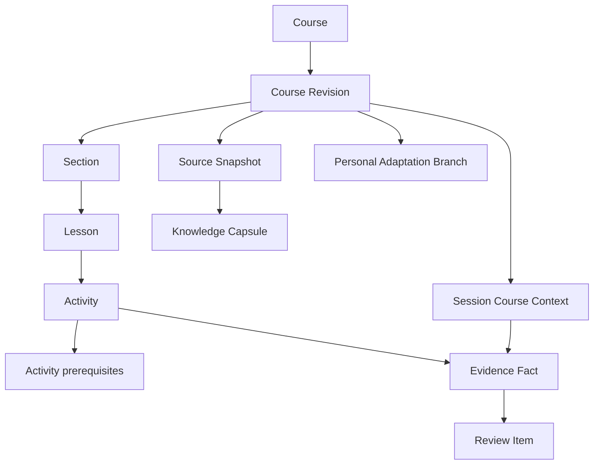

# M2–M11 Core Alpha Data Model

**Document status:** Course foundations, Course Pack lifecycle, replay-complete Learning Kernel persistence, trusted Execution Fabric identity, Provider Hub, Adaptive Studio, Course Designer, and per-Course learner state added through migrations `0006`–`0018` are an **Implemented baseline**. Destructive compatibility-table removal and PostgreSQL operation remain **Approved Core Alpha target**.

## Authority and boundaries

`Course` is the top-level entity. `packages/shared/src/course.ts` is the boundary-schema authority, `packages/learning-core/src/activity-graph.ts` owns deterministic finite-graph validation, and `packages/database` owns persistence and migration. Domain DTOs use camel-case fields and do not expose SQLite row shapes, PRAGMAs, paths, or transactions.

The M2–M11 implementation is additive. Legacy curriculum, session, progress, evidence, exercise, test, and review tables from the historical Dev Learning Harness baseline remain preserved for Aptiloop compatibility reads. Target repositories own Course/Pack/kernel/execution/provider/authoring/learner-state records; compatibility reads are explicitly bounded and do not make quarantined source rows valid target facts.

## Core Course aggregate

### Identity and ownership

- Opaque entity IDs identify stored records. Stable IDs identify authored meaning and are unique in their declared Course/revision scope.
- A revision has an increasing positive revision number, optional parent, `upstream` or `personal` branch kind, and `draft`, `published`, or `archived` status.
- Composite foreign keys carry `course_id`, `revision_id`, and, where applicable, `lesson_id`. A child cannot point across Course/revision/lesson scope even when a text ID exists elsewhere.
- Reusing a stable ID for changed meaning is rejected by the shared stable-identity fingerprint contract; migration never silently reassigns meaning.

### Authored graph

`courses`, `course_revisions`, `course_sections`, `course_lessons`, `course_lesson_prerequisites`, `course_activities`, and `course_activity_prerequisites` persist the authored graph.

The activity registry is closed to:

- `briefing`, `study`, `recall`, `teacher-dialogue`;
- `quiz`, `code-reading`, `exercise`, `review`;
- `interview`, `summary`, `checkpoint`, `spaced-review`.

The shared schema bounds IDs, text, list sizes, JSON depth/container size, and serialized JSON size. It separates learner-visible activity fields and typed payload from `protectedMaterial`. Protected questions/reference material are stored in `protected_material_json`; they are not included in the learner activity DTO.

Before persistence, the learning-core validator rejects:

- duplicate lesson/activity stable IDs;
- duplicate graph IDs or order positions;
- unknown activity or evidence types;
- missing, self, cross-lesson, or cross-revision prerequisites;
- graph cycles.

SQLite reinforces ownership and direct self-reference constraints. Application validation owns full cycle detection because SQLite foreign keys alone cannot prove finiteness.

### Sources and capsules

`source_snapshots` stores immutable acquired content with exact source locator, retrieval method, acquisition time, content SHA-256, locale, provenance/rights claims, and captured content. A snapshot is Course/revision-owned; a live URL is never silently treated as mutable course truth.

`knowledge_capsules` and `knowledge_capsule_sources` store immutable structured claims, citations, conflicts, and source bindings. `createdBy` is closed to `manual`, `typed-ai-proposal`, or `migration`. Model output cannot bypass validation or become authoritative evidence.

Production content approval is not a data-model property. Dated release/content status is recorded in the [2026-08-12 runtime-hardening audit](audits/2026-08-12-ui-ux-runtime-hardening.md); the schema and repositories remain valid for immutable local development/imported snapshots and capsules regardless of that inventory.

### Personal adaptation

`adaptation_branches` stores a local single-user branch from an immutable published base revision/content hash. It never edits the upstream revision. **Implemented baseline:** M9 and Course Pack Open-as-draft persist the branch identity, base/head relationship, and mutable personal Draft lineage. Applying a broader generated learner-adaptation proposal remains an **Approved Core Alpha target** and cannot mutate upstream history.

### Immutable session context

`session_course_contexts` binds one `learning_sessions` row to an exact Course, revision, lesson, optional adaptation branch, and exact source snapshot ID/hash. Inserts require a valid target ownership chain. Update and delete are blocked.

`session_snapshots` remains the legacy/versioned captured graph. M2 adds immutability guards and preserves all pre-migration JSON and hashes byte-for-byte. New target reads return explicit Course context.

A pre-M2 session without `session_course_contexts` is compatible only when exact `m2-v1` quarantine provenance exists for its source curriculum revision, curriculum lesson, and its actual session snapshot. Unknown or unaccounted missing contexts fail closed.

### Evidence and review

`evidence_facts` is append-only and typed. Each fact has:

- a unique operation ID for idempotency;
- exact Course/revision/lesson/activity/session ownership;
- a closed evidence type;
- occurrence and recording times;
- bounded payload and typed provenance.

The evidence registry is closed to learner attempts, quiz/code-reading/exercise/review/interview/checkpoint/summary facts defined by `EvidenceFactTypeSchema`. Repository validation rejects an activity/evidence mismatch. LLM output does not set correctness, mastery, progression, review scheduling, or evidence truth.

`review_items` references one source Evidence fact in the same Course/revision/activity/session scope. Kind and status registries are closed. Review Items are projections; they do not replace their source fact.

The Review queue preserves due state and source fact/session provenance, but provenance is not an executable target. The current boundary fixes `nextActionHref` to `null` until an **Approved Core Alpha target** typed due-review executor can resolve exact review content and append completion evidence; no ordinary source session is fabricated or reopened.

**Implemented baseline.** Migration `0012_learning_kernel` adds immutable accepted facts, canonical replay projections, review/mistake/mastery state, and migration provenance/quarantine. New versioned learner operations are adapted into closed kernel facts and projected transactionally; replay from the same accepted frontier reproduces the stored canonical bytes/hash. Provable legacy progress is backfilled with source provenance, while ambiguous summaries remain immutable quarantine records. Legacy source rows and older projections remain readable for compatibility; they do not override kernel authority.

### Course Pack and Execution Fabric records

Migration `0011_course_pack_lifecycle` stores immutable validated manifest identity/canonical JSON, source-byte hash, validation report, provenance, append-only install/open-as-draft/uninstall lifecycle events, and bounded invalid-pack quarantine diagnostics. Imported Course/revision/source/capsule rows retain hash-bound ownership; uninstall archives a local installation and never deletes shared Course history or learner evidence.

Pre-commit Course Pack validation is not a database record. The orchestrator keeps bounded validation metadata in a process-local LRU and valid bytes in a private temporary directory. A non-consuming GET can recover the report/Preview only while that process and validation remain alive. Expiry or restart requires explicit file reselection; abrupt process death may leave a temporary directory because no startup orphan sweep exists.

Migration `0013_execution_fabric` stores immutable app-distributed Environment Pack and trusted-check descriptors, exact environment/check identity on attempts and test runs, normalized process artifacts bound to the complete-workspace snapshot SHA-256, immutable review evidence bundles, and quarantine for legacy runs whose input snapshot cannot be proven. Process plans remain code-owned and are not stored in Course Pack or browser payloads.

### Provider Hub, Course Designer, and Interview recovery

Migration `0014_provider_hub` stores secret-free connections, exact per-role profiles/tool policies, immutable `ai_disclosure_operations`, append-only disclosure events, and terminal minimized provider-turn provenance. A disclosure is bound to provider, connection, model, role, destination, entity scope, payload categories, byte count, payload SHA-256, and expiry. The disclosed payload is not stored in the disclosure record; approval is append-only and one exact operation may be consumed once.

Migration `0016_course_designer_workflow` stores a version/authoring-operation-bound workflow request, finite state, immutable events, proposals, and immutable attribution. Pending-disclosure recovery re-resolves one exact Course version/workflow/authoring operation and reconstructs the brief from server-owned workflow/Draft/source state. Browser storage is not recovery authority, and unknown, ambiguous, cross-version, cancelled, consumed, or expired disclosures fail closed.

`interview_sessions` binds an Interview to its exact learning session and persists the finite setup/question/transcript/report state used for restart. Start and answer operation identities are exact-payload bound; answer dispatch is reconstructed from the persisted transcript/current question. A server-returned `resumeOperationId` locates only the matching pending disclosure scope. Cross-session/interview/question, terminal, ambiguous, cancelled, consumed, and expired recovery fails closed. Interview reports remain completion/form observations, not technical correctness or mastery.

### Per-Course learner selection

Migrations `0017_learner_course_state` and `0018_learner_course_state_trigger_guard` store one selected Course and independent active revision/current-session pointers per Course. Only an active session on a published target revision may advance the pointer. Completed, historical, and compatibility-only sessions remain readable but cannot silently change current Course state.

## Immutability and mutation matrix

| Record                                      | Draft write                                  | Published/historical mutation              | Delete                                                        |
| ------------------------------------------- | -------------------------------------------- | ------------------------------------------ | ------------------------------------------------------------- |
| Course                                      | Repository-controlled metadata write         | Allowed only by explicit repository policy | Restricted by owned revisions                                 |
| Course Revision graph                       | Allowed while revision is `draft`            | Blocked for `published`/`archived`         | Blocked for historical graph                                  |
| Source Snapshot / Capsule                   | Insert                                       | Update blocked                             | Delete blocked                                                |
| Session Course Context / Session Snapshot   | Insert once                                  | Update blocked                             | Delete blocked                                                |
| Evidence Fact                               | Append once; duplicate operation ID rejected | Update blocked                             | Delete blocked                                                |
| Review Item projection                      | Kernel-derived insert/status update          | Source identity immutable                  | Delete blocked                                                |
| Course Pack manifest/localization/knowledge | Insert validated canonical content           | Update blocked                             | Delete blocked                                                |
| Course Pack lifecycle/quarantine            | Append once                                  | Update blocked                             | Delete blocked                                                |
| Migration run/provenance/quarantine         | Append during authorized migration           | Update blocked                             | Delete blocked                                                |
| Environment Pack / trusted check descriptor | App-distributed insert                       | Update blocked                             | Delete blocked while referenced                               |
| Execution artifact / review evidence bundle | Append once                                  | Update blocked                             | Delete blocked                                                |
| Provider connection / RoleProfile           | Explicit settings mutation                   | Repository-controlled                      | History remains referenced                                    |
| Disclosure operation / event                | Insert/append once                           | Update blocked                             | Delete blocked                                                |
| Provider turn provenance                    | Insert as `started`                          | One terminal status/time/failure update    | Delete blocked                                                |
| Course Designer workflow request/event      | Insert/append through finite workflow        | Request/event immutable                    | Delete blocked                                                |
| Course proposal attribution                 | Insert once                                  | Update blocked                             | Delete blocked                                                |
| Learner Course state                        | Server-owned projection                      | Active target operations only              | Explicit uninstall only when no active scoped session remains |

Database triggers enforce the historical mutation boundary independently of repository callers.

## Migration accounting

`migration_runs`, `migration_provenance`, and `migration_quarantine` are append-only. Each provenance record names the source table/primary key, source database digest, transform version, target identity when mapped, and one status:

- `mapped` — a target relationship was proven;
- `quarantined` — mapping was ambiguous or unprovable and is not target truth;
- `intentionally-unmapped` — the source type is preserved but outside the M2 target mapping.

The normative requirement is complete arithmetic reconciliation, valid closed statuses, and zero target orphans; quarantined records never become approved target content merely because the accounting balances. Dated observed row counts, active-database hashes, and postflight results belong to the [M2 migration/recovery runbook](migration/m2-course-foundations-runbook.md) and [Core Alpha migration strategy](migration/core-alpha-migration-strategy.md), not this model contract.

## Exact admitted schemas

Ordinary startup and writable CLIs admit only the exact current `0000`–`0018` migration ledger/schema/trigger contract. Dated observed schema hashes are recorded with migration evidence rather than embedded as a timeless domain invariant.

The explicitly authorized, backup-bound migration CLI alone may admit exact predecessor stages from `0000`–`0005` through `0000`–`0017` long enough to apply every missing forward migration. Every path requires `integrity_check=ok`, zero foreign-key violations, the exact expected schema/triggers for its ledger, and complete private-payload inspection. The current contract additionally requires reconciled M2 provenance, zero target orphans, immutable Course Pack/kernel/execution/provider/authoring history, and coherent `learner_course_states`: at most one selected Course, a published active revision owned by that Course, and an optional current session whose active status and immutable Course context match exactly. Context insertion advances learner state only for an active session on a published target revision; completed and compatibility-only contexts do not mutate that state.

## Current cutover and limitations

Course-scoped discovery/path/start/resume reads target Course ownership. `learner_course_states` supplies the selected Course plus per-Course active revision/current session, so simultaneous active sessions in different Courses do not abandon one another. M3 Course Pack install/export, M4 accepted facts/projections, M5 environment/check/artifact records, M6 Provider Hub/disclosure records, M9 personal adaptation, M10 Course Designer state, and M11 learner Course state use target repositories. Legacy v1 mutations and the hardcoded dashboard return 410. Exact historical session reads, compatibility storage, the synthetic day bridge, immutable snapshots, and quarantine remain locally retained; destructive removal is not authorized.

The only implemented store is SQLite. Domain contracts remain repository-oriented so a later PostgreSQL implementation does not change Course semantics.
